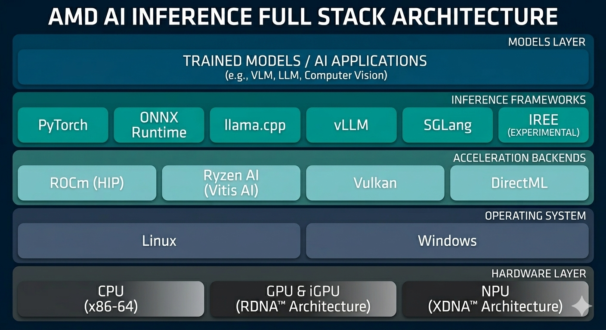

# AMD Software Architecture Overview

## Purpose

The AMD software stack ecosystem is rapidly evolving with frequent updates and new releases. Multiple software stacks may coexist at different levels of maturity, with overlapping functionality and varying degrees of stability. This page provides a comprehensive overview of the current AMD software stack landscape, enabling you to select the most suitable stack for your specific use case based on your hardware, target models, and deployment requirements.

!!! note "Note"
    This documentation was last updated on May 27, 2026. Given the rapid evolution of AMD's software ecosystem, information here may become outdated. We recommend regularly checking the AMD official documentation for the latest updates and releases.

