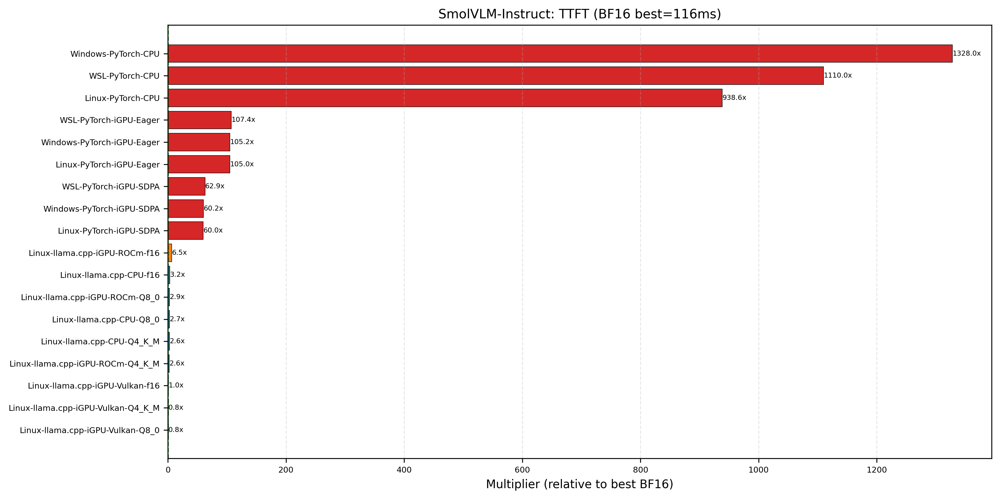
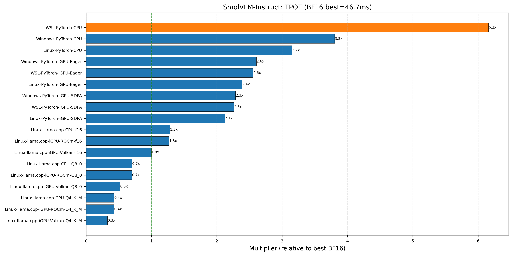
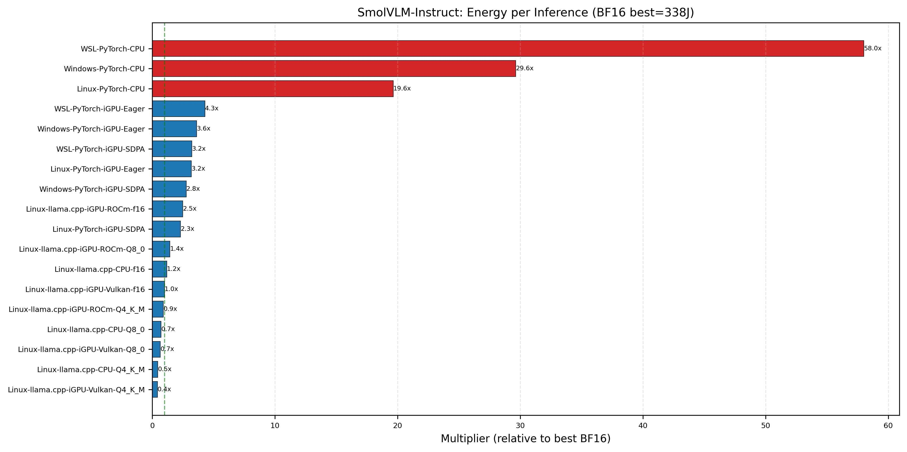
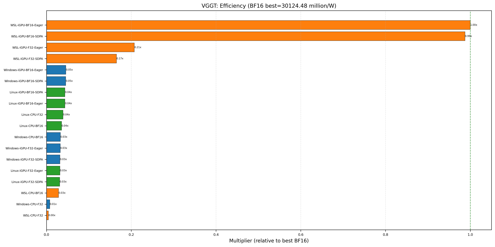

# Profiling & Benchmarking Results

## Overview

This section documents performance profiling for **SmolVLM** (vision-language) and **VGGT** (3D vision) models on the **AMD Ryzen 7 8845HS APU (Radeon 780M)** across three environments: Windows, WSL, and Linux.

!!! info "Navigation"
    - [Methodology](methodology.md) — Hardware, software, metrics, measurement methods
    - [Full Results](result.md) — All data tables and charts

---

## Key Findings

### SmolVLM-Instruct

llama.cpp with **FP16 quantization on Vulkan** achieves the best inference performance: **116ms TTFT, 47ms TPOT** — roughly **60× faster** than PyTorch BF16. This makes f16 the practical choice for real-time deployment on this hardware.

PyTorch BF16 remains the only option when full precision is required, but it is significantly slower (~6934ms TTFT). All llama.cpp quantizations (f16, Q8_0, Q4_K_M) benefit from Vulkan offloading, which also slashes memory from 3–7 GB down to ~0.2 GB.

!!! warning "llama.cpp Support Note"
    llama.cpp requires a quick-fix patch for SmolVLM-Instruct because the tokenizer lacks the `<global-img>` marker token, causing `lookup_token` to return `LLAMA_TOKEN_NULL`. The patch filters out null tokens during decoding. A proper fix requires adding the missing marker during HF→GGUF conversion. We will submit a GitHub issue upstream. **For production use, `SmolVLM2-2.2B-Instruct` is recommended** — it has proper llama.cpp support without patches and achieves the same ~95ms TTFT with Q4_K_M on Vulkan.

!!! info "Precision Note"
    FP16 (`f16`) is the preferred quantization for inference on this hardware. It provides the best balance of speed, memory efficiency, and accuracy. `Q8_0` is nearly as fast with slightly lower memory. `Q4_K_M` is fastest but introduces the most quantization error.

### SmolVLM Family

- **FP16 on Vulkan is the recommended inference configuration** across all models: ~21ms TTFT for 256M, ~42ms for 500M, ~117ms for 2.2B.
- **Q8_0 offers the best precision-efficiency tradeoff**: within ~10% of f16 latency with roughly half the memory of f16.
- **Q4_K_M is the fastest quantization** but trades accuracy for speed; suitable for latency-critical, accuracy-tolerant workloads.
- **ROCm backend** performs on par with CPU in llama.cpp and draws significantly more power (~105W vs ~48W) with no meaningful speed advantage.
- **Vulkan offloading reduces host memory from 3–7 GB (CPU) down to 0.13–0.26 GB**, critical for memory-constrained deployments.

### VGGT

!!! warning "WSL Performance Anomaly"
    VGGT runs **~20× faster on WSL** than on native Linux iGPU (e.g., BF16 SDPA: 1.56s vs 30.3s per image). This is likely because Windows' NVIDIA/AMD driver provides far better Conv operator support than TheRock's community-level ROCm build on Linux. WSL shares the Windows GPU driver, giving it an unexpected advantage.

VGGT is fundamentally **CPU-bound** due to its architecture — GPU acceleration provides only marginal benefit. The fastest configuration is iGPU-BF16 on Linux at ~30.3s per image (0.066 img/s), while WSL achieves ~1.56s with the same model.

---

## Quick Navigation

| Section | Content |
|---|---|
| [Methodology](methodology.md) | Hardware specs, software versions, metric definitions |
| [SmolVLM-Instruct](result.md#1-smolvlm-instruct) | PyTorch + llama.cpp results across all backends |
| [VGGT](result.md#2-vggt) | All configs across platforms |
| [Full SmolVLM Family](result.md#3-full-smolvlm-family-all-models) | All models, PyTorch + llama.cpp |

## Next Steps

!!! example "Planned Work"
    1. **Test llama.cpp on Windows** (CPU + Vulkan) and **WSL** (CPU + ROCm)
    2. **Evaluate quantization accuracy** on TextVQA and AI2D benchmarks