# Profiling Results

> See [methodology](methodology.md) for test setup and metric definitions.

---

## 1. SmolVLM-Instruct

| Dtype | Configuration | TTFT (ms) | TPOT (ms) | Avg Power (W) | Energy per Inference (J) | Peak Memory (GB) | Tokens per Joule |
|---|---|---|---|---|---|---|---|
| **BF16** | Windows-PyTorch-CPU | 153479.1 | 177.8 | 50.65 | 10026.4 | 5.07 | 0.0128 |
| | WSL-PyTorch-CPU | 128283.0 | 288.0 | 45.26 | 19624.3 | 5.92 | 0.0065 |
| | Linux-PyTorch-CPU | 108474.0 | 147.4 | 51.03 | 6645.3 | 6.30 | 0.0193 |
| | Windows-PyTorch-iGPU-Eager | 12153.4 | 121.9 | 41.99 | 1224.4 | 7.85 | 0.1045 |
| | WSL-PyTorch-iGPU-Eager | 12407.0 | 119.5 | 45.63 | 1454.5 | 7.85 | 0.0880 |
| | Linux-PyTorch-iGPU-Eager | 12136.2 | 111.5 | 38.91 | 1078.3 | 7.85 | 0.1187 |
| | Windows-PyTorch-iGPU-SDPA | 6954.4 | 107.0 | 42.75 | 936.4 | 5.09 | 0.1367 |
| | WSL-PyTorch-iGPU-SDPA | 7272.6 | 105.9 | 45.49 | 1091.4 | 5.09 | 0.1173 |
| | Linux-PyTorch-iGPU-SDPA | 6933.8 | 99.22 | 37.65 | 777.9 | 5.09 | 0.1645 |
| **f16** | Linux-llama.cpp-CPU | 371.1 | 59.98 | 47.65 | 400.7 | 7.02 | 0.319 |
| | Linux-llama.cpp-iGPU-Vulkan | 115.6 | 46.75 | 53.29 | 338.3 | 0.20 | 0.378 |
| | Linux-llama.cpp-iGPU-ROCm | 750.7 | 59.47 | 97.87 | 845.4 | 7.02 | 0.151 |
| **Q8_0** | Linux-llama.cpp-CPU | 306.9 | 32.90 | 51.28 | 244.1 | 5.43 | 0.524 |
| | Linux-llama.cpp-iGPU-Vulkan | 94.7 | 24.37 | 67.43 | 222.3 | 0.20 | 0.576 |
| | Linux-llama.cpp-iGPU-ROCm | 339.9 | 32.81 | 105.3 | 489.1 | 5.44 | 0.262 |
| **Q4_K_M** | Linux-llama.cpp-CPU | 305.1 | 20.12 | 51.95 | 155.9 | 4.68 | 0.821 |
| | Linux-llama.cpp-iGPU-Vulkan | 95.3 | 15.36 | 68.10 | 143.3 | 0.20 | 0.893 |
| | Linux-llama.cpp-iGPU-ROCm | 295.7 | 20.10 | 105.2 | 308.9 | 4.68 | 0.414 |

### Charts

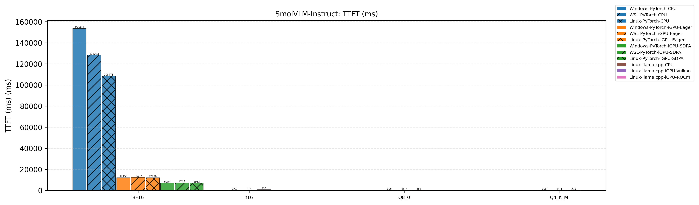

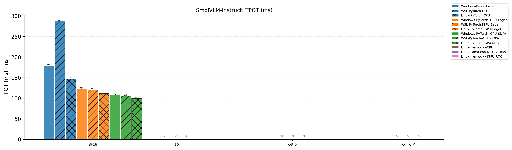

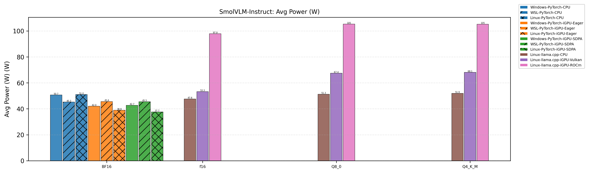

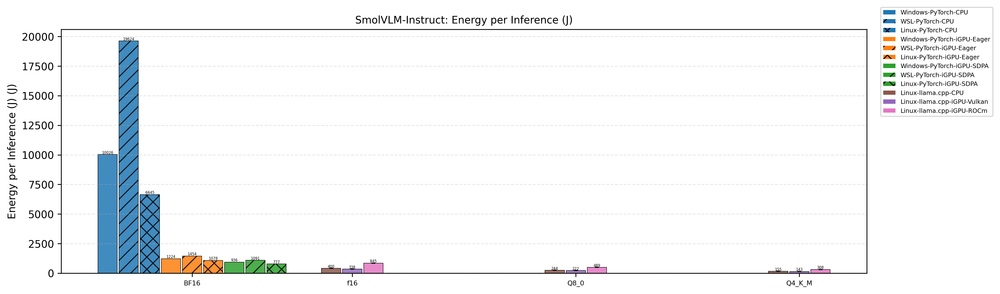

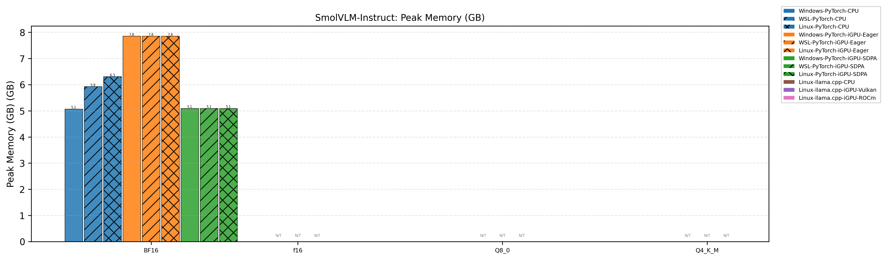

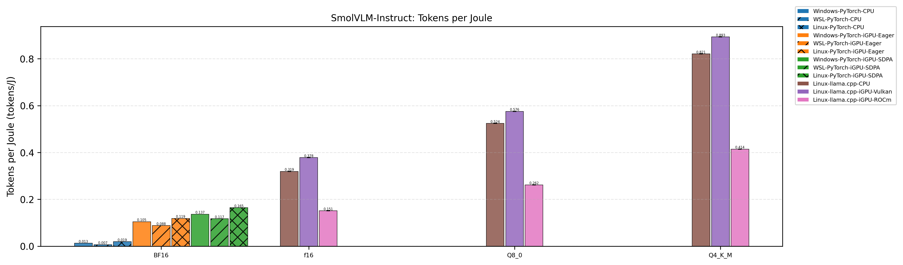

---

## 2. VGGT

!!! warning "Incomplete Data"
    iGPU results on Windows and WSL are incomplete. BF16 iGPU failed on both platforms (`RuntimeError: Input type (float) and bias type (c10::BF16) should be the same`). SDPA was not tested on Windows/WSL. iGPU-F32-Eager results on Windows/WSL were removed due to suspected data quality issues.

| Configuration | Environment | Latency (ms) | Throughput (img/s) | Avg Power (W) | Energy per Inference (J) | Peak Memory (GB) | Efficiency (img/W) |
|---|---|---|---|---|---|---|---|
| **CPU-F32** | Windows-PyTorch | 192306.4 | 0.0104 | 43.73 | 9041.0 | 6.20 | 0.000238 |
| | WSL-PyTorch | 327644.5 | 0.0061 | 43.05 | 17067.2 | 5.27 | - |
| | Linux-PyTorch | 32687.5 | 0.0612 | 51.92 | 1755.9 | 6.14 | 0.0012 |
| **CPU-BF16** | Windows-PyTorch | 39947.1 | 0.0501 | 50.43 | 2170.3 | 6.65 | 0.000993 |
| | WSL-PyTorch | 54331.9 | 0.0368 | 42.65 | 2808.3 | 4.88 | - |
| | Linux-PyTorch | 35774.6 | 0.0559 | 52.07 | 1917.4 | 5.29 | 0.0011 |
| **iGPU-F32-Eager** | Windows-PyTorch | - | - | - | - | - | - |
| | WSL-PyTorch | - | - | - | - | - | - |
| | Linux-PyTorch | 43262.8 | 0.0462 | 48.34 | 2166.6 | 5.19 | 0.000956 |
| **iGPU-F32-SDPA** | Linux-PyTorch | 45133.0 | 0.0443 | 47.16 | 2221.3 | 5.19 | 0.000940 |
| | Windows-PyTorch | - | - | - | - | - | - |
| | WSL-PyTorch | - | - | - | - | - | - |
| **iGPU-BF16-Eager** | Linux-PyTorch | 30321.9 | 0.0660 | 50.15 | 1585.1 | 2.71 | 0.0013 |
| | Windows-PyTorch | - | - | - | - | - | - |
| | WSL-PyTorch | - | - | - | - | - | - |
| **iGPU-BF16-SDPA** | Linux-PyTorch | 30303.0 | 0.0660 | 50.17 | 1580.6 | 2.71 | 0.0013 |
| | Windows-PyTorch | - | - | - | - | - | - |
| | WSL-PyTorch | - | - | - | - | - | - |

### Charts

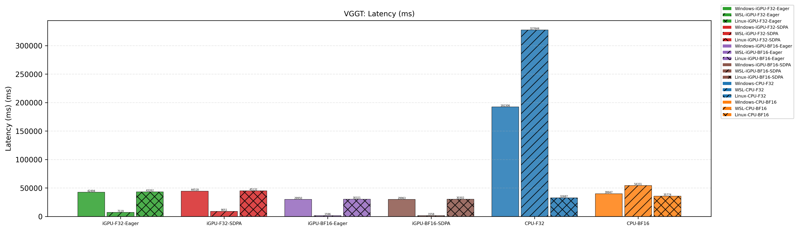

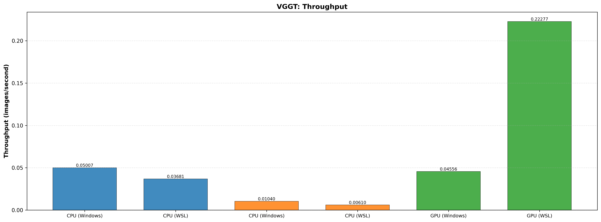

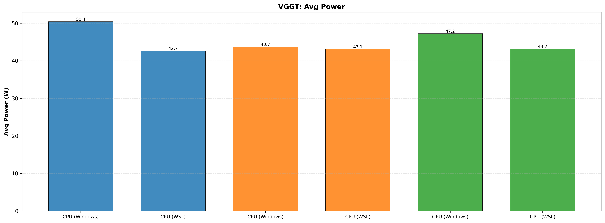

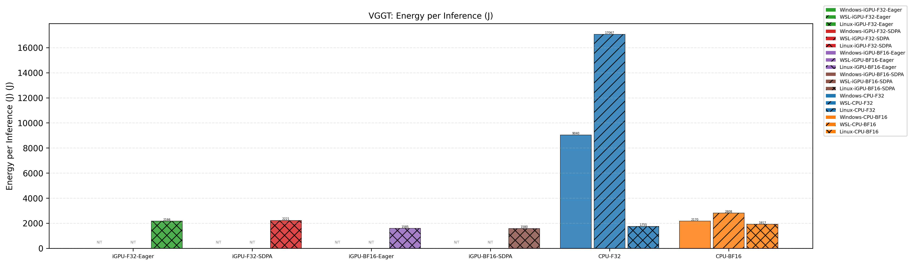

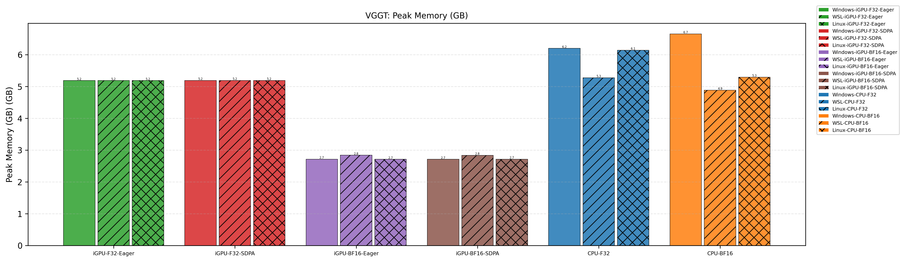

---

## 3. Full SmolVLM Family (All Models)

!!! info "Model Naming & Test Environment"
    SmolVLM-Instruct (original) and SmolVLM2-* (second generation, adds video understanding). **All tests in this table are on Linux** — PyTorch rows use iGPU-BF16-SDPA, llama.cpp rows cover CPU/Vulkan/ROCm backends.

| Model | Backend | Dtype | TTFT (ms) | TPOT (ms) | Avg Power (W) | Energy per Inference (J) | Peak Memory (GB) | Tokens per Joule |
|---|---|---|---|---|---|---|---|---|
| **SmolVLM-256M-Instruct** | PyTorch-iGPU-sdpa | bf16 | 2133.4 | 17.84 | 33.52 | 155.6 | 1.39 | 0.8229 |
| | llama.cpp-cpu | f16 | 66.73 | 5.45 | 48.59 | 38.61 | 0.63 | 3.32 |
| | llama.cpp-cpu | Q8_0 | 32.45 | 3.33 | 51.85 | 24.76 | 0.48 | 5.17 |
| | llama.cpp-cpu | Q4_K_M | - | - | - | - | - | - |
| | llama.cpp-vulkan | f16 | 20.57 | 4.89 | 47.37 | 31.89 | 0.13 | 4.01 |
| | llama.cpp-vulkan | Q8_0 | 19.52 | 3.53 | 65.51 | 31.57 | 0.13 | 4.05 |
| | llama.cpp-vulkan | Q4_K_M | - | - | - | - | - | - |
| | llama.cpp-rocm | f16 | 67.66 | 5.44 | 98.94 | 77.36 | 0.63 | 1.65 |
| | llama.cpp-rocm | Q8_0 | 31.84 | 3.28 | 105.5 | 48.53 | 0.48 | 2.64 |
| | llama.cpp-rocm | Q4_K_M | - | - | - | - | - | - |
| **SmolVLM-500M-Instruct** | PyTorch-iGPU-sdpa | bf16 | 2421.5 | 28.22 | 34.57 | 219.3 | 1.87 | 0.5838 |
| | llama.cpp-cpu | f16 | 168.9 | 13.45 | 48.53 | 95.79 | 1.23 | 1.34 |
| | llama.cpp-cpu | Q8_0 | 70.13 | 7.68 | 51.86 | 56.86 | 0.87 | 2.25 |
| | llama.cpp-cpu | Q4_K_M | - | - | - | - | - | - |
| | llama.cpp-vulkan | f16 | 42.32 | 10.90 | 50.26 | 72.77 | 0.14 | 1.76 |
| | llama.cpp-vulkan | Q8_0 | 40.42 | 6.57 | 60.51 | 54.98 | 0.14 | 2.33 |
| | llama.cpp-vulkan | Q4_K_M | - | - | - | - | - | - |
| | llama.cpp-rocm | f16 | 168.8 | 13.44 | 98.66 | 191.1 | 1.23 | 0.67 |
| | llama.cpp-rocm | Q8_0 | 76.26 | 7.68 | 105.2 | 114.0 | 0.87 | 1.12 |
| | llama.cpp-rocm | Q4_K_M | - | - | - | - | - | - |
| **SmolVLM-Instruct** | PyTorch-iGPU-sdpa | bf16 | 6933.8 | 99.22 | 37.65 | 777.9 | 5.09 | 0.1645 |
| | llama.cpp-cpu | f16 | 371.1 | 59.98 | 47.65 | 400.7 | 7.02 | 0.319 |
| | llama.cpp-cpu | Q8_0 | 306.9 | 32.90 | 51.28 | 244.1 | 5.43 | 0.524 |
| | llama.cpp-cpu | Q4_K_M | 305.1 | 20.12 | 51.95 | 155.9 | 4.68 | 0.821 |
| | llama.cpp-vulkan | f16 | 115.6 | 46.75 | 53.29 | 338.3 | 0.20 | 0.378 |
| | llama.cpp-vulkan | Q8_0 | 94.7 | 24.37 | 67.43 | 222.3 | 0.20 | 0.576 |
| | llama.cpp-vulkan | Q4_K_M | 95.3 | 15.36 | 68.10 | 143.3 | 0.20 | 0.893 |
| | llama.cpp-rocm | f16 | 750.7 | 59.47 | 97.87 | 845.4 | 7.02 | 0.151 |
| | llama.cpp-rocm | Q8_0 | 339.9 | 32.81 | 105.3 | 489.1 | 5.44 | 0.262 |
| | llama.cpp-rocm | Q4_K_M | 295.7 | 20.10 | 105.2 | 308.9 | 4.68 | 0.414 |
| **SmolVLM2-256M-Video-Instruct** | PyTorch-iGPU-sdpa | bf16 | 2132.4 | 17.85 | 32.62 | 152.0 | 1.39 | 0.8418 |
| | llama.cpp-cpu | f16 | 67.47 | 5.44 | 48.70 | 38.86 | 0.63 | 3.29 |
| | llama.cpp-cpu | Q8_0 | 30.14 | 3.31 | 51.93 | 24.57 | 0.48 | 5.21 |
| | llama.cpp-cpu | Q4_K_M | - | - | - | - | - | - |
| | llama.cpp-vulkan | f16 | 20.51 | 4.88 | 48.29 | 32.38 | 0.15 | 3.95 |
| | llama.cpp-vulkan | Q8_0 | 20.41 | 3.52 | 66.04 | 31.73 | 0.15 | 4.03 |
| | llama.cpp-vulkan | Q4_K_M | - | - | - | - | - | - |
| | llama.cpp-rocm | f16 | 67.09 | 5.43 | 98.77 | 77.72 | 0.63 | 1.65 |
| | llama.cpp-rocm | Q8_0 | 32.27 | 3.29 | 105.6 | 48.76 | 0.48 | 2.62 |
| | llama.cpp-rocm | Q4_K_M | - | - | - | - | - | - |
| **SmolVLM2-500M-Video-Instruct** | PyTorch-iGPU-sdpa | bf16 | 2422.5 | 28.08 | 33.99 | 214.4 | 1.87 | 0.5969 |
| | llama.cpp-cpu | f16 | 175.6 | 13.41 | 48.84 | 96.01 | 1.23 | 1.33 |
| | llama.cpp-cpu | Q8_0 | 74.27 | 7.69 | 51.93 | 57.24 | 0.87 | 2.24 |
| | llama.cpp-cpu | Q4_K_M | - | - | - | - | - | - |
| | llama.cpp-vulkan | f16 | 41.51 | 10.87 | 50.68 | 73.26 | 0.14 | 1.75 |
| | llama.cpp-vulkan | Q8_0 | 39.46 | 6.54 | 60.74 | 54.86 | 0.14 | 2.33 |
| | llama.cpp-vulkan | Q4_K_M | - | - | - | - | - | - |
| | llama.cpp-rocm | f16 | 178.2 | 13.43 | 99.00 | 191.9 | 1.23 | 0.67 |
| | llama.cpp-rocm | Q8_0 | 74.62 | 7.65 | 105.2 | 113.5 | 0.87 | 1.13 |
| | llama.cpp-rocm | Q4_K_M | - | - | - | - | - | - |
| **SmolVLM2-2.2B-Instruct** | PyTorch-iGPU-sdpa | bf16 | 6618.9 | 96.95 | 37.07 | 742.7 | 5.03 | 0.1723 |
| | llama.cpp-cpu | f16 | 845.5 | 59.62 | 48.27 | 427.3 | 5.53 | 0.30 |
| | llama.cpp-cpu | Q8_0 | 342.4 | 32.83 | 51.89 | 245.6 | 3.94 | 0.52 |
| | llama.cpp-cpu | Q4_K_M | 293.5 | 20.01 | 52.31 | 154.2 | 3.18 | 0.83 |
| | llama.cpp-vulkan | f16 | 116.5 | 46.66 | 52.77 | 333.2 | 0.22 | 0.38 |
| | llama.cpp-vulkan | Q8_0 | 94.98 | 24.41 | 65.65 | 216.1 | 0.22 | 0.59 |
| | llama.cpp-vulkan | Q4_K_M | 95.07 | 15.33 | 66.96 | 139.8 | 0.26 | 0.92 |
| | llama.cpp-rocm | f16 | 838.7 | 59.56 | 97.96 | 849.2 | 5.53 | 0.15 |
| | llama.cpp-rocm | Q8_0 | 343.8 | 32.72 | 105.3 | 487.7 | 3.94 | 0.26 |
| | llama.cpp-rocm | Q4_K_M | 289.5 | 19.97 | 105.4 | 307.5 | 3.18 | 0.42 |
 
!!! note "Quantization note"
    The official releases do not provide Q4_K_M quantization for the 256M and 500M models, likely due to accuracy concerns. Therefore this project did not test those quantizations.

### Charts

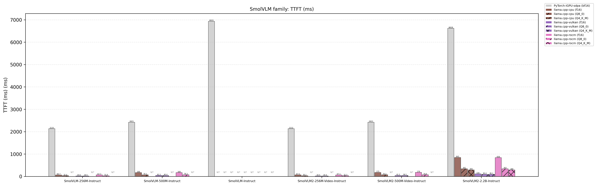

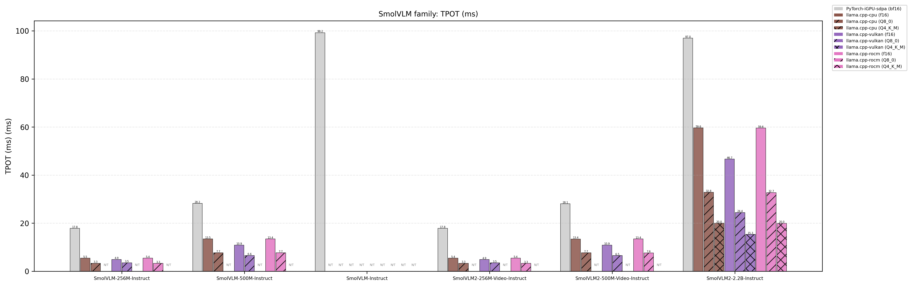

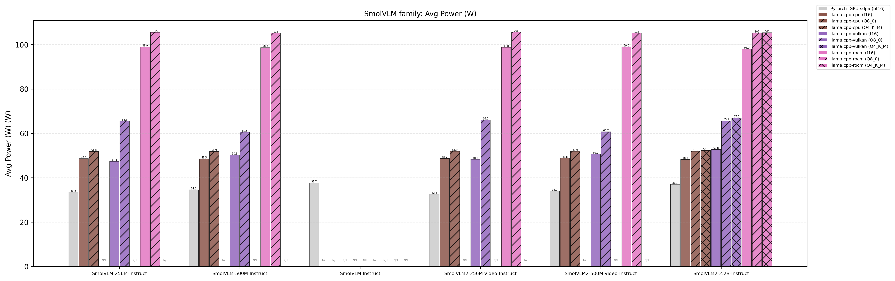

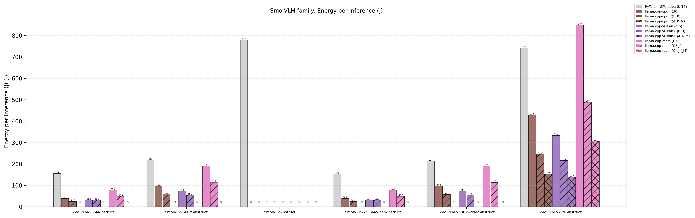

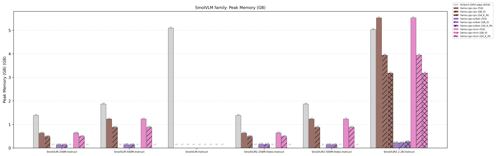

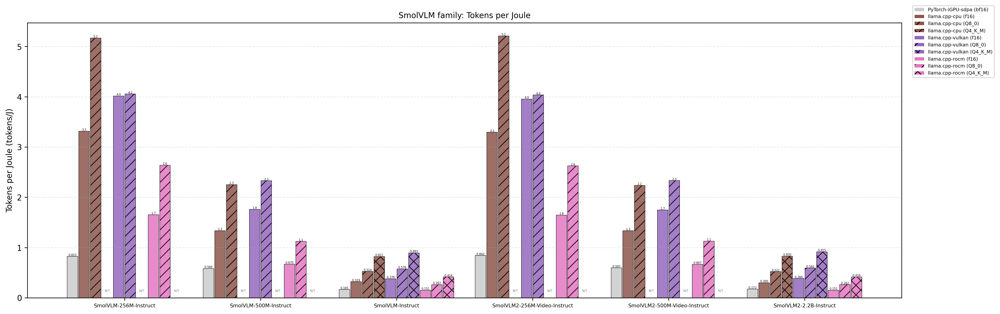

---

## Legend

- `-` / `N/T` — Not tested, failed, removed, or not applicable (e.g. no GGUF file for this quantization)
- **WSL power**: Measured from Windows host via RAPL
- **Platform**: AMD Radeon 780M (RDNA 3, 12 CU), Ryzen 7 8845HS