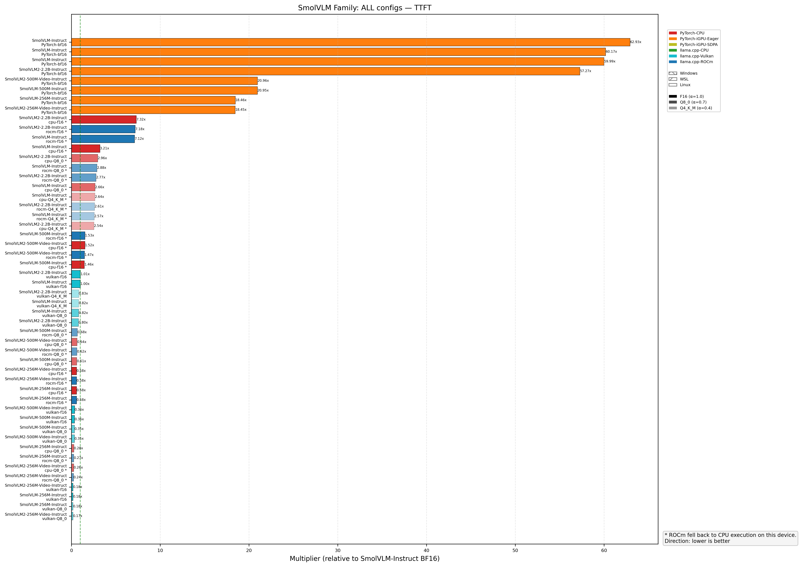
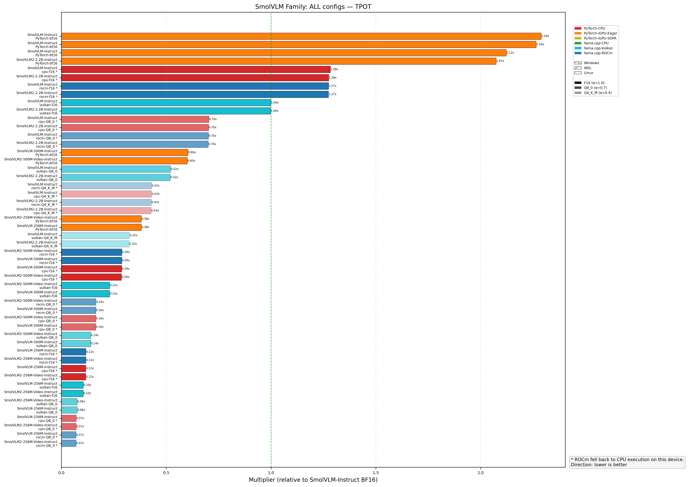
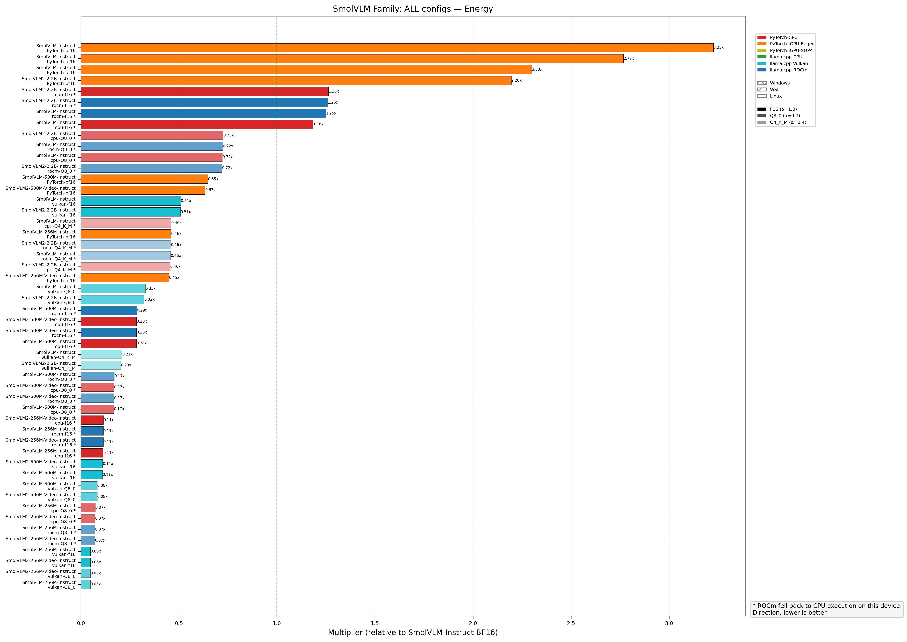
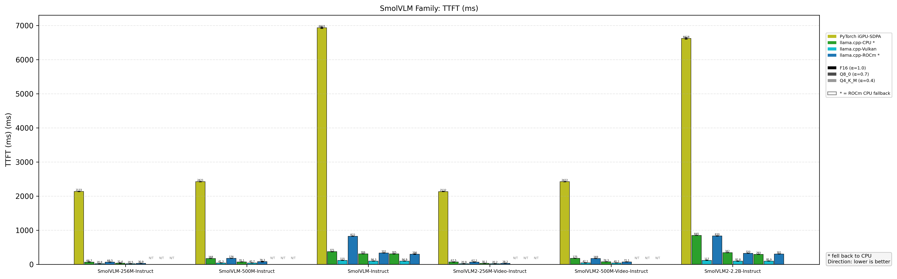
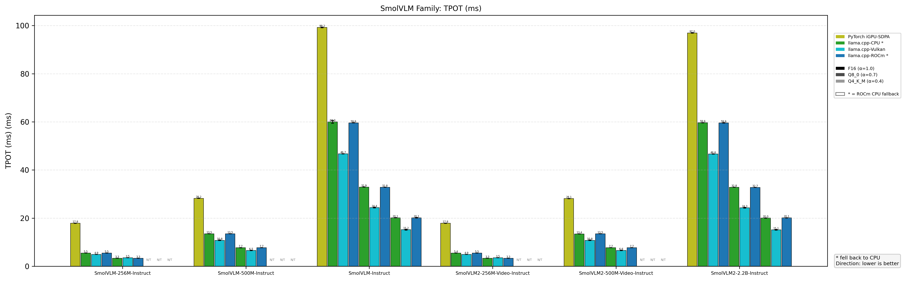
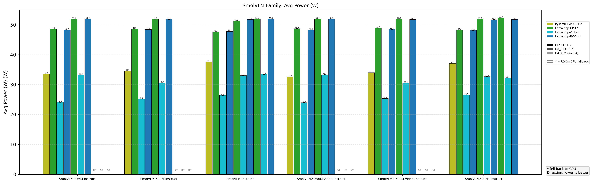
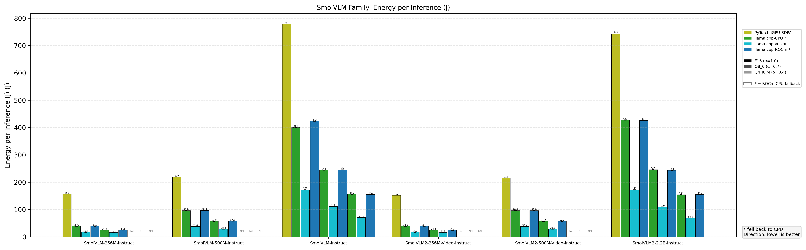
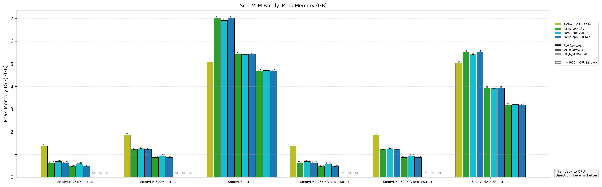
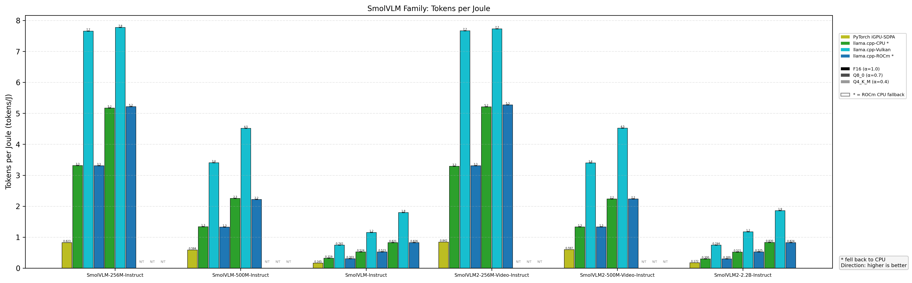

# Profiling & Benchmarking

Profiling results for **SmolVLM** and **SmolVLM2** family on AMD Radeon 780M (gfx1103). See [Methodology](../Profiling_Methodology.md) for hardware, software, and measurement details.

---

## 1. SmolVLM-Instruct (2.2B)

### Charts

### Raw Data

| Dtype | Configuration | TTFT (ms) | TPOT (ms) | Avg Power (W) | Energy per Inference (J) | Peak Memory (GB) | Tokens per Joule |
|---|---|---|---|---|---|---|---|
| **BF16** | Windows-PyTorch-CPU | 153479.1 | 177.8 | 50.65 | 10026.4 | 5.07 | 0.0128 |
| | WSL-PyTorch-CPU | 128283.0 | 288.0 | 45.26 | 19624.3 | 5.92 | 0.0065 |
| | Linux-PyTorch-CPU | 108474.0 | 147.4 | 51.03 | 6645.3 | 6.30 | 0.0193 |
| | Windows-PyTorch-iGPU-Eager | 12153.4 | 121.9 | 41.99 | 1224.4 | 7.85 | 0.1045 |
| | WSL-PyTorch-iGPU-Eager | 12407.0 | 119.5 | 45.63 | 1454.5 | 7.85 | 0.0880 |
| | Linux-PyTorch-iGPU-Eager | 12136.2 | 111.5 | 38.91 | 1078.3 | 7.85 | 0.1187 |
| | Windows-PyTorch-iGPU-SDPA | 6954.4 | 107.0 | 42.75 | 936.4 | 5.09 | 0.1367 |
| | WSL-PyTorch-iGPU-SDPA | 7272.6 | 105.9 | 45.49 | 1091.4 | 5.09 | 0.1173 |
| | Linux-PyTorch-iGPU-SDPA | 6933.8 | 99.22 | 37.65 | 777.9 | 5.09 | 0.1645 |
| **f16** | Linux-llama.cpp-CPU | 371.1 | 59.98 | 47.65 | 400.7 | 7.02 | 0.319 |
| | Linux-llama.cpp-iGPU-Vulkan | 115.9 | 46.71 | 26.40 | 172.4 | 6.91 | 0.742 |
| | Linux-llama.cpp-iGPU-ROCm | 822.6 | 59.59 | 47.74 | 422.9 | 7.02 | 0.303 |
| **Q8_0** | Linux-llama.cpp-CPU | 306.9 | 32.90 | 51.28 | 244.1 | 5.43 | 0.524 |
| | Linux-llama.cpp-iGPU-Vulkan | 94.3 | 24.35 | 33.01 | 111.3 | 5.42 | 1.150 |
| | Linux-llama.cpp-iGPU-ROCm | 332.9 | 32.81 | 51.76 | 244.8 | 5.44 | 0.523 |
| **Q4_K_M** | Linux-llama.cpp-CPU | 305.1 | 20.12 | 51.95 | 155.9 | 4.68 | 0.821 |
| | Linux-llama.cpp-iGPU-Vulkan | 94.9 | 15.18 | 33.43 | 71.3 | 4.71 | 1.795 |
| | Linux-llama.cpp-iGPU-ROCm | 296.6 | 20.13 | 51.88 | 155.0 | 4.68 | 0.826 |

---

## 2. Full SmolVLM Family (All Models)

### Charts — Family Normalized Ratios

### Charts — Family

### Raw Data

| Model | Backend | Dtype | TTFT (ms) | TPOT (ms) | Avg Power (W) | Energy per Inference (J) | Peak Memory (GB) | Tokens per Joule |
|---|---|---|---|---|---|---|---|---|
| **SmolVLM-256M-Instruct** | PyTorch-iGPU-sdpa | bf16 | 2133.4 | 17.84 | 33.52 | 155.6 | 1.39 | 0.8229 |
| | llama.cpp-cpu | f16 | 66.7 | 5.45 | 48.59 | 38.6 | 0.63 | 3.32 |
| | llama.cpp-cpu | Q8_0 | 32.4 | 3.33 | 51.85 | 24.8 | 0.48 | 5.17 |
| | llama.cpp-vulkan | f16 | 20.8 | 4.90 | 24.07 | 16.7 | 0.69 | 7.66 |
| | llama.cpp-vulkan | Q8_0 | 20.5 | 3.52 | 33.19 | 16.5 | 0.58 | 7.78 |
| | llama.cpp-rocm | f16 | 66.5 | 5.48 | 48.19 | 38.7 | 0.63 | 3.31 |
| | llama.cpp-rocm | Q8_0 | 30.9 | 3.30 | 51.91 | 24.5 | 0.48 | 5.22 |
| **SmolVLM-500M-Instruct** | PyTorch-iGPU-sdpa | bf16 | 2421.5 | 28.22 | 34.57 | 219.3 | 1.87 | 0.5838 |
| | llama.cpp-cpu | f16 | 168.9 | 13.45 | 48.53 | 95.8 | 1.23 | 1.34 |
| | llama.cpp-cpu | Q8_0 | 70.1 | 7.68 | 51.86 | 56.9 | 0.87 | 2.25 |
| | llama.cpp-vulkan | f16 | 41.3 | 10.77 | 25.19 | 37.6 | 1.26 | 3.41 |
| | llama.cpp-vulkan | Q8_0 | 40.7 | 6.55 | 30.60 | 28.3 | 0.94 | 4.52 |
| | llama.cpp-rocm | f16 | 176.5 | 13.48 | 48.40 | 96.4 | 1.23 | 1.33 |
| | llama.cpp-rocm | Q8_0 | 78.3 | 7.71 | 51.80 | 57.7 | 0.87 | 2.22 |
| **SmolVLM-Instruct** | PyTorch-iGPU-sdpa | bf16 | 6933.8 | 99.22 | 37.65 | 777.9 | 5.09 | 0.1645 |
| | llama.cpp-cpu | f16 | 371.1 | 59.98 | 47.65 | 400.7 | 7.02 | 0.319 |
| | llama.cpp-cpu | Q8_0 | 306.9 | 32.90 | 51.28 | 244.1 | 5.43 | 0.524 |
| | llama.cpp-cpu | Q4_K_M | 305.1 | 20.12 | 51.95 | 155.9 | 4.68 | 0.821 |
| | llama.cpp-vulkan | f16 | 115.9 | 46.71 | 26.40 | 172.4 | 6.91 | 0.742 |
| | llama.cpp-vulkan | Q8_0 | 94.3 | 24.35 | 33.01 | 111.3 | 5.42 | 1.15 |
| | llama.cpp-vulkan | Q4_K_M | 94.9 | 15.18 | 33.43 | 71.3 | 4.71 | 1.80 |
| | llama.cpp-rocm | f16 | 822.6 | 59.59 | 47.74 | 422.9 | 7.02 | 0.303 |
| | llama.cpp-rocm | Q8_0 | 332.9 | 32.81 | 51.76 | 244.8 | 5.44 | 0.523 |
| | llama.cpp-rocm | Q4_K_M | 296.6 | 20.13 | 51.88 | 155.0 | 4.68 | 0.826 |
| **SmolVLM2-256M-Video-Instruct** | PyTorch-iGPU-sdpa | bf16 | 2132.4 | 17.85 | 32.62 | 152.0 | 1.39 | 0.8418 |
| | llama.cpp-cpu | f16 | 67.5 | 5.44 | 48.70 | 38.9 | 0.63 | 3.29 |
| | llama.cpp-cpu | Q8_0 | 30.1 | 3.31 | 51.93 | 24.6 | 0.48 | 5.21 |
| | llama.cpp-vulkan | f16 | 20.9 | 4.89 | 23.96 | 16.7 | 0.69 | 7.67 |
| | llama.cpp-vulkan | Q8_0 | 20.2 | 3.52 | 33.33 | 16.6 | 0.58 | 7.73 |
| | llama.cpp-rocm | f16 | 67.2 | 5.47 | 48.25 | 38.7 | 0.63 | 3.31 |
| | llama.cpp-rocm | Q8_0 | 28.2 | 3.28 | 51.88 | 24.3 | 0.48 | 5.27 |
| **SmolVLM2-500M-Video-Instruct** | PyTorch-iGPU-sdpa | bf16 | 2422.5 | 28.08 | 33.99 | 214.4 | 1.87 | 0.5969 |
| | llama.cpp-cpu | f16 | 175.6 | 13.41 | 48.84 | 96.0 | 1.23 | 1.33 |
| | llama.cpp-cpu | Q8_0 | 74.3 | 7.69 | 51.93 | 57.2 | 0.87 | 2.24 |
| | llama.cpp-vulkan | f16 | 42.1 | 10.77 | 25.31 | 37.7 | 1.26 | 3.40 |
| | llama.cpp-vulkan | Q8_0 | 40.2 | 6.56 | 30.48 | 28.3 | 0.94 | 4.52 |
| | llama.cpp-rocm | f16 | 169.7 | 13.48 | 48.48 | 96.0 | 1.23 | 1.33 |
| | llama.cpp-rocm | Q8_0 | 72.1 | 7.71 | 51.75 | 57.2 | 0.87 | 2.24 |
| **SmolVLM2-2.2B-Instruct** | PyTorch-iGPU-sdpa | bf16 | 6618.9 | 96.95 | 37.07 | 742.7 | 5.03 | 0.1723 |
| | llama.cpp-cpu | f16 | 845.5 | 59.62 | 48.27 | 427.3 | 5.53 | 0.30 |
| | llama.cpp-cpu | Q8_0 | 342.4 | 32.83 | 51.89 | 245.6 | 3.94 | 0.52 |
| | llama.cpp-cpu | Q4_K_M | 293.5 | 20.01 | 52.31 | 154.2 | 3.18 | 0.83 |
| | llama.cpp-vulkan | f16 | 117.3 | 46.63 | 26.47 | 172.1 | 5.41 | 0.74 |
| | llama.cpp-vulkan | Q8_0 | 92.8 | 24.30 | 32.65 | 109.3 | 3.92 | 1.17 |
| | llama.cpp-vulkan | Q4_K_M | 95.9 | 15.11 | 32.25 | 68.9 | 3.21 | 1.86 |
| | llama.cpp-rocm | f16 | 830.3 | 59.57 | 48.12 | 426.0 | 5.53 | 0.30 |
| | llama.cpp-rocm | Q8_0 | 320.4 | 32.75 | 51.70 | 243.6 | 3.94 | 0.53 |
| | llama.cpp-rocm | Q4_K_M | 301.5 | 20.08 | 51.78 | 155.3 | 3.19 | 0.82 |

!!! note "Quantization note"
    The official releases do not provide Q4_K_M quantization for the 256M and 500M models, likely due to accuracy concerns. Therefore this project did not test those quantizations.

---

## Legend

- `-` — Not tested (no GGUF file for this quantization)
- **WSL power**: Measured from Windows host via RAPL
- **Platform**: AMD Radeon 780M (RDNA 3, 12 CU), Ryzen 7 8845HS
