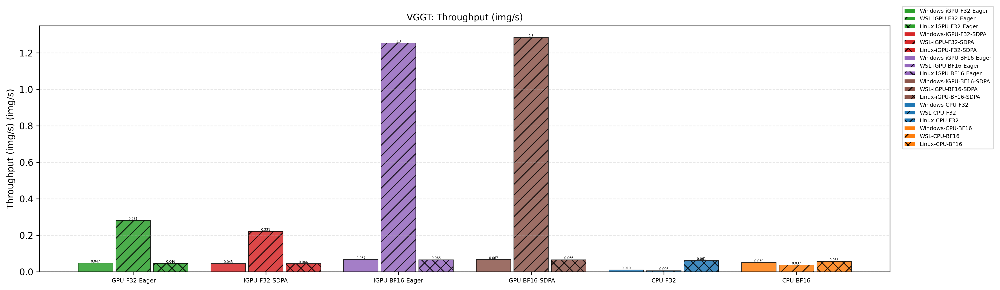
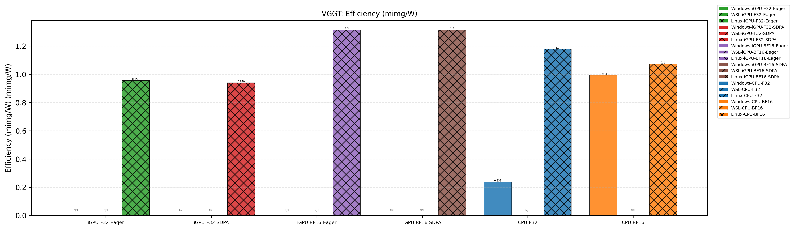

# Profiling & Benchmarking

Profiling results for **VGGT-1B** (3D vision) on AMD Radeon 780M (gfx1103). See [Methodology](../../Profiling_Methodology.md) for hardware, software, and measurement details.

---

## 1. VGGT-1B

### Charts

### Raw Data

| Configuration | Environment | Latency (ms) | Throughput (img/s) | Avg Power (W) | Energy per Inference (J) | Peak Memory (GB) | Efficiency (million images / W) |
|---|---|---|---|---|---|---|---|
| **CPU-F32** | Windows-PyTorch | 192306.4 | 0.0104 | 43.73 | 9041.0 | 6.20 | 0.000238 |
| | WSL-PyTorch | 327644.5 | 0.0061 | 43.05 | 17067.2 | 5.27 | 0.000142 |
| | Linux-PyTorch | 32687.5 | 0.0612 | 51.92 | 1755.9 | 6.14 | 0.0012 |
| **CPU-BF16** | Windows-PyTorch | 39947.1 | 0.0501 | 50.43 | 2170.3 | 6.65 | 0.000993 |
| | WSL-PyTorch | 54331.9 | 0.0368 | 42.65 | 2808.3 | 4.88 | 0.000863 |
| | Linux-PyTorch | 35774.6 | 0.0559 | 52.07 | 1917.4 | 5.29 | 0.0011 |
| **iGPU-F32-Eager** | Windows-PyTorch | 42494.5 | 0.0471 | 47.96 | 2179.6 | 5.19 | 0.0010 |
| | WSL-PyTorch | 7119.6 | 0.2809 | 44.95 | 371.6 | 5.19 | 0.006249 |
| | Linux-PyTorch | 43262.8 | 0.0462 | 48.34 | 2166.6 | 5.19 | 0.000956 |
| **iGPU-F32-SDPA** | Linux-PyTorch | 45133.0 | 0.0443 | 47.16 | 2221.3 | 5.19 | 0.000940 |
| | Windows-PyTorch | 44518.8 | 0.0449 | 46.95 | 2243.8 | 5.19 | 0.0010 |
| | WSL-PyTorch | 9051.7 | 0.2210 | 44.39 | 465.2 | 5.19 | 0.004978 |
| **iGPU-BF16-Eager** | Linux-PyTorch | 30321.9 | 0.0660 | 50.15 | 1585.1 | 2.71 | 0.0013 |
| | Windows-PyTorch | 29950.1 | 0.0668 | 48.28 | 1544.8 | 2.71 | 0.0014 |
| | WSL-PyTorch | 1596.6 | 1.2526 | 41.58 | 79.1 | 2.84 | 0.030124 |
| **iGPU-BF16-SDPA** | Linux-PyTorch | 30303.0 | 0.0660 | 50.17 | 1580.6 | 2.71 | 0.0013 |
| | Windows-PyTorch | 29963.6 | 0.0667 | 48.62 | 1545.1 | 2.71 | 0.0014 |
| | WSL-PyTorch | 1558.2 | 1.2835 | 43.15 | 78.6 | 2.84 | 0.029747 |

---

## Legend

- **WSL power**: Measured from Windows host via RAPL
- **Platform**: AMD Radeon 780M (RDNA 3, 12 CU), Ryzen 7 8845HS
- **Input**: 2 images × 518px
