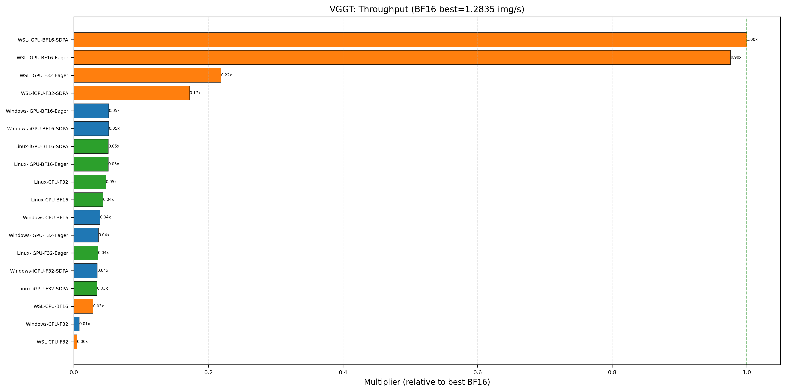

# VGGT Overview

VGGT (Visual Geometry Group Transformer) is a feed-forward model developed by Facebook Research for **3D visual perception** — estimating camera parameters, depth maps, and point maps from a set of input images. Unlike generative VLMs, VGGT is a **discriminative 3D reconstruction model**, making it a different class of perception model.

---

## Framework Recommendation

| Framework | Recommendation | Reason |
|-----------|---------------|--------|
| **PyTorch** | ✅ Recommended | Only fully supported option. Official code + BF16 adaptation available. Use **BF16 + SDPA** for best inference speed. |
| **ONNX Runtime** | ❌ Not recommended | No automated export tool works. Community exports exist but have fixed dimensions and inefficiency issues |

!!! warning "WSL vs Linux Performance Anomaly"
    VGGT runs **~20× faster on WSL** than native Linux iGPU for the same BF16-SDPA config (~1.56s vs ~30.3s per image).

    **Root cause**: The performance gap stems from the GPU driver stack, not the OS itself:

    - **Linux** uses [TheRock](https://github.com/ROCm/TheRock), a community ROCm build in **early preview** — its MIOpen (convolution kernel library) lacks optimized Conv kernels for `gfx1103`. The missing `.fdb.txt` kernel database causes Conv2d/ConvTranspose2d to fall back to slow software paths.
    - **WSL** uses [librocdxg](https://github.com/ROCm/librocdxg) to bridge GPU compute to the **production-grade Windows AMD driver**, which ships with a complete MIOpen kernel database. Since [v1.2.0](https://github.com/ROCm/librocdxg/releases/tag/v1.2.0) (May 2026), `gfx1103` is officially supported.

    This gap is most pronounced for **Conv-heavy models** like VGGT (DPTHead uses many Conv2d/ConvTranspose2d layers). Transformer-heavy models (e.g. SmolVLM) see no difference because their compute is dominated by GEMM and attention, not convolutions.

    If WSL is available, it is the preferred host environment for Conv-heavy models on `gfx1103`. Self-hosted Linux will be CPU-bound at ~30s/image.

!!! tip "Deployment Profile"
    - **WSL** (BF16, iGPU, SDPA): **~1.56s/image, ~2.84GB memory**, highest throughput
    - **Linux** (BF16, iGPU, SDPA): **~30.3s/image, ~2.71GB memory**, self-hosted fallback
    - **Linux** (BF16, CPU): **~35.8s/image, ~5.3GB memory**, viable on memory-constrained hosts

---

## Key Profiling Chart

The following chart shows throughput relative to the best configuration (WSL iGPU-BF16-SDPA).



---

## Transformer Usage

VGGT uses Vision Transformer (ViT) architecture but in a way that differs from standard LLM/VLM inference:

- The model processes multiple images jointly in a single forward pass, rather than autoregressively generating tokens
- The transformer is used for spatial understanding across image pairs, not for text generation
- This non-standard usage means that many general-purpose inference frameworks (vLLM, ONNX Runtime, etc.) **do not support VGGT out of the box**

## PyTorch Notes

### BF16 Support

The official repository only supports **FP32** inference. We adapted it to use **BF16**:

- Inference and results appear **normal** with BF16
- Performance is significantly better than FP32 on both CPU and iGPU
- **Caveat**: For production use, we recommend **further validation** — test on your own scenes with fixed image dimensions and input sizes over extended runs

### Image Constraints

VGGT imposes a strict constraint: the **short edge of input images must be a multiple of 14**. The `load_and_preprocess_images` utility handles this automatically, but custom data pipelines must respect this.

## ONNX Runtime

- No automated tooling exists to convert VGGT to a working ONNX format
- Community-provided exports (e.g. [akretz/vggt-onnx](https://github.com/akretz/vggt-onnx)) have **fixed dimensions** that are difficult to modify and suffer from low efficiency

## Citation

```bibtex
@inproceedings{wang2026vggt,
  title={VGGT: Visual Geometry Grounded Transformer},
  author={Wang, Jianyuan and others},
  booktitle={CVPR},
  year={2026}
}
```