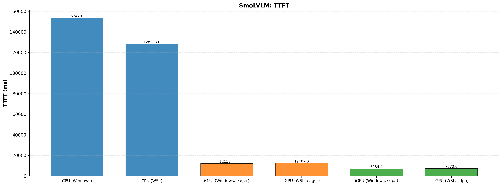
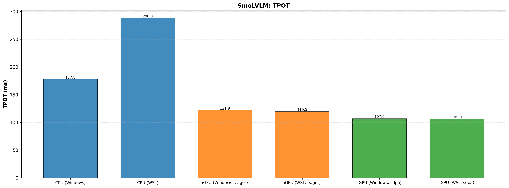
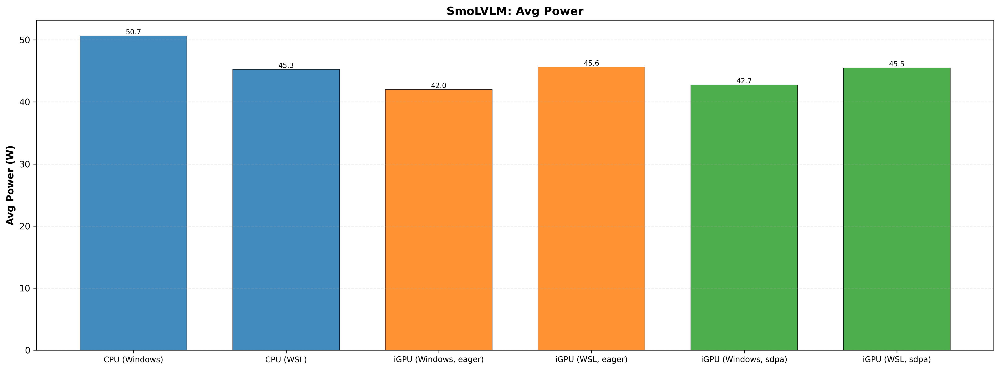
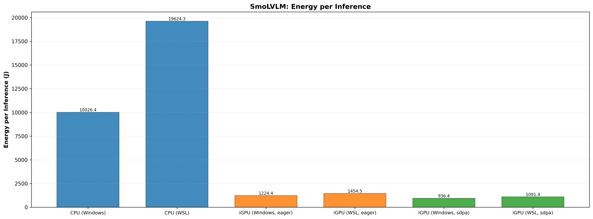
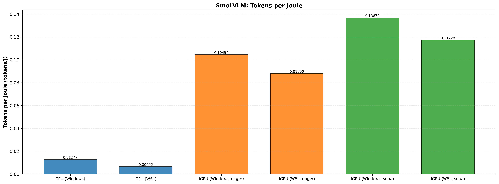
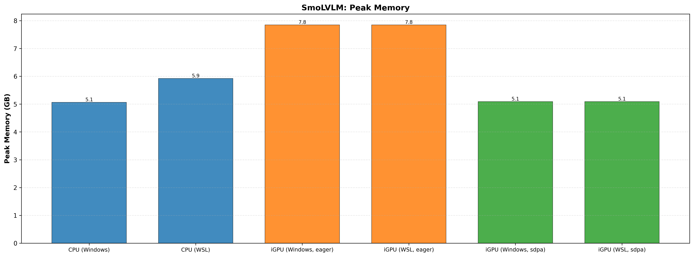

# Profiling & Benchmarking Results

## Overview

This section contains comprehensive profiling and benchmarking results for both SmoLVLM and VGGT models across different execution environments and configurations.

### Test Environments

- **Windows**: Native Windows CUDA environment
- **WSL**: Windows Subsystem for Linux with CUDA support
- **Ubuntu**: Native Linux environment (data needs validation)

### Configurations Tested

For each model, we tested multiple configurations:

- **SmoLVLM**:
  - CPU (BFloat16)
  - iGPU (Eager attention, BFloat16)
  - iGPU (SDPA attention, BFloat16)

- **VGGT**:
  - CPU (Float32)
  - GPU (Float32)

---

## Key Findings

### SmoLVLM

1. **Latency Performance**:
   - iGPU with SDPA provides the best latency (6.9-7.3 seconds TTFT)
   - iGPU Eager is faster than SDPA for token generation (TPOT)
   - CPU baseline is significantly slower (~128-153 seconds TTFT)

2. **Memory Usage**:
   - CPU: ~5.1-5.9 GB (RSS memory)
   - iGPU Eager: ~7.8 GB (VRAM)
   - iGPU SDPA: ~5.1 GB (VRAM)

3. **Energy Efficiency**:
   - iGPU configurations consume less energy per inference than CPU
   - SDPA provides better tokens-per-joule ratio

4. **Environment Comparison**:
   - Windows and WSL show similar performance characteristics
   - Environment differences are minimal for GPU workloads

### VGGT

1. **Latency Performance**:
   - GPU processing is significantly faster than CPU (43.9 ms vs 192+ ms)
   - Consistent performance across Windows and WSL

2. **Memory Usage**:
   - CPU: 4.9-6.8 GB
   - GPU: 5.2-5.4 GB

3. **Power Efficiency**:
   - GPU provides better performance-per-watt despite higher absolute power consumption
   - More efficient for batch processing

---

## Conclusions

### Platform Comparison

1. **GPU Performance**:
   - Windows GPU and WSL GPU show virtually identical performance
   - Ubuntu GPU performance appears to be equivalent to WSL (pending validation)

2. **CPU Performance**:
   - Ubuntu CPU performance is superior to both Windows and WSL
   - Likely due to better Linux kernel optimization for CPU workloads
   - Difference ranges from 10-20% depending on workload

3. **Recommendations**:
   - **For GPU-bound workloads**: Windows and WSL offer equivalent performance; choose based on ecosystem preference
   - **For CPU-bound inference**: Ubuntu or native Linux deployment is recommended
   - **For development**: WSL provides good balance of Windows convenience and Linux performance

### Model-Specific Insights

**SmoLVLM**:
- Strongly benefits from GPU acceleration (20-30x speedup vs CPU)
- SDPA attention provides better latency characteristics
- iGPU (GPU) SDPA configuration is optimal for most scenarios

**VGGT**:
- Significant speedup with GPU (4-5x vs CPU)
- More balanced memory consumption than SmoLVLM
- Suitable for both mobile and server deployment depending on configuration

---

## Important Notes

!!! note "Ubuntu Data Validation Required"
    
    The profiling data from Ubuntu/Linux environment shows some anomalies and requires validation. Ubuntu GPU performance data may not be fully accurate in the current results. A fresh profiling run is recommended for Ubuntu to ensure data consistency and accuracy.
    
    **Action Items**:
    - Re-run comprehensive profiling on Ubuntu environment
    - Verify CUDA and driver configurations
    - Compare results with Windows and WSL baselines

---

## Detailed Performance Charts

### SmoLVLM Results

#### Time to First Token (TTFT)

The Time to First Token metric shows latency for generating the first token, which is critical for interactive applications.

#### Time Per Output Token (TPOT)

Time Per Output Token represents the sustained throughput during token generation.

#### Power Consumption

Average power consumption across different configurations and environments.

#### Energy per Inference

Total energy consumed per inference run.

#### Tokens per Joule

Energy efficiency metric showing tokens generated per unit of energy consumed.

#### Memory Usage

Peak memory allocation during inference. CPU configurations show total RSS memory, GPU configurations show VRAM usage.

---

### VGGT Results

#### Inference Latency

Time required to process a single image through the model.

#### Throughput

Number of images processed per second.

#### Power Consumption

Average power consumption across configurations.

#### Energy per Inference

Energy consumed per image inference.

#### Memory Usage

Peak memory usage during image processing.

---

## Testing Methodology

- **Warmup iterations**: 10
- **Test iterations**: 20 (latency), 10 (power)
- **Measurement mode**: RAPL (Windows/WSL), perf counters (Linux where available)
- **Data types**: BFloat16 (SmoLVLM), Float32 (VGGT)
- **Output tokens**: 128 (SmoLVLM), varied (VGGT)

For detailed methodology and profiling scripts, refer to the benchmark configuration files and scripts in the repository.
