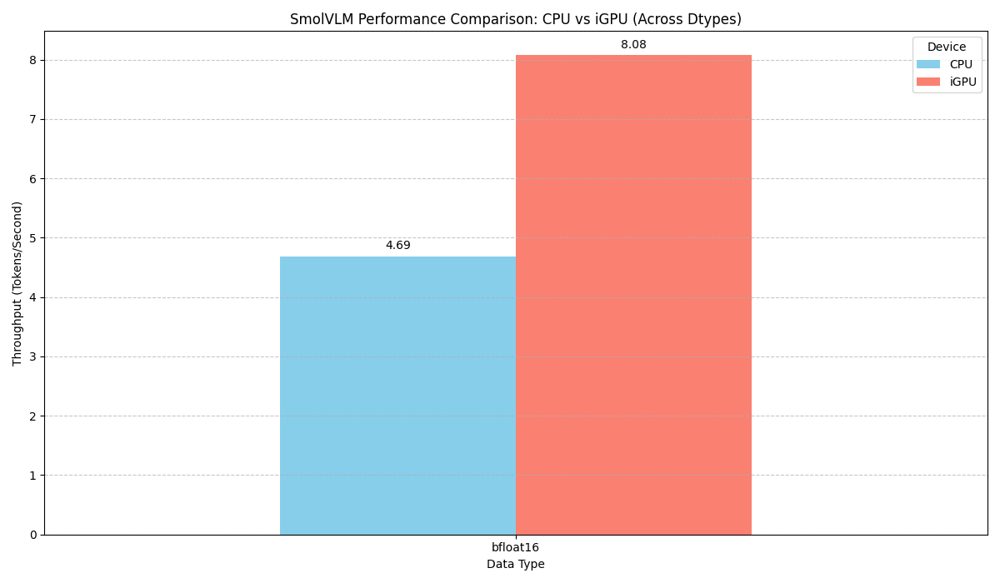
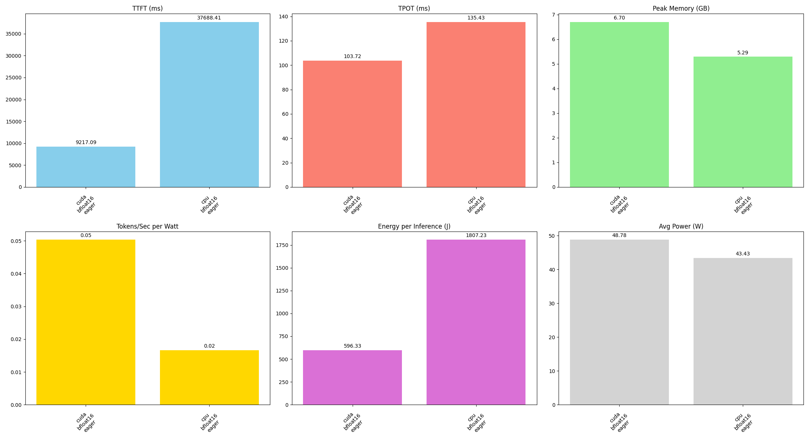

# Pytorch

## install dependencies

```bash
source venv/bin/activate
uv pip install transformers
```

## run the example codes

```bash
watch amd-smi
```

```python
import torch
from PIL import Image
from transformers import AutoProcessor

# From transformers>=5.0.0, AutoTokenizer is renamed as AutoModelForImageTextToText
from transformers import AutoModelForImageTextToText as AutoModelForVision2Seq

from transformers.image_utils import load_image

DEVICE = "cuda" if torch.cuda.is_available() else "cpu"

# Load images
image1 = load_image("https://cdn.britannica.com/61/93061-050-99147DCE/Statue-of-Liberty-Island-New-York-Bay.jpg")
image2 = load_image("https://huggingface.co/spaces/merve/chameleon-7b/resolve/main/bee.jpg")

# Initialize processor and model
processor = AutoProcessor.from_pretrained("HuggingFaceTB/SmolVLM-Instruct")
model = AutoModelForVision2Seq.from_pretrained(
    "HuggingFaceTB/SmolVLM-Instruct",
    torch_dtype=torch.bfloat16,
    _attn_implementation="flash_attention_2" if DEVICE == "cuda" else "eager",
).to(DEVICE)

# Create input messages
messages = [
    {
        "role": "user",
        "content": [
            {"type": "image"},
            {"type": "image"},
            {"type": "text", "text": "Can you describe the two images?"}
        ]
    },
]

# Prepare inputs
prompt = processor.apply_chat_template(messages, add_generation_prompt=True)
inputs = processor(text=prompt, images=[image1, image2], return_tensors="pt")
inputs = inputs.to(DEVICE)

# Generate outputs
generated_ids = model.generate(**inputs, max_new_tokens=500)
generated_texts = processor.batch_decode(
    generated_ids,
    skip_special_tokens=True,
)

print(generated_texts[0])
"""
Assistant: The first image shows a green statue of the Statue of Liberty standing on a stone pedestal in front of a body of water. 
The statue is holding a torch in its right hand and a tablet in its left hand. The water is calm and there are no boats or other objects visible. 
The sky is clear and there are no clouds. The second image shows a bee on a pink flower. 
The bee is black and yellow and is collecting pollen from the flower. The flower is surrounded by green leaves.
"""

```

### pytorch (CPU vs iGPU)

For fairness, the test is based on `bf16` as accelerations are available on both sides.

#### Baseline


#### Detailed profiling


#### Trace

- [ ] [WIP] Adding trace now will result in OOM.