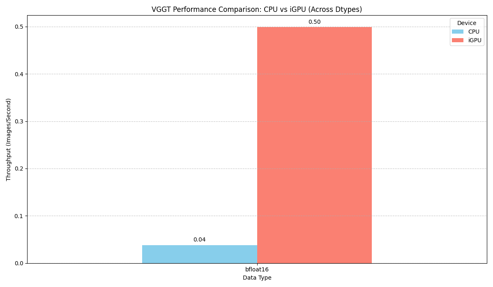
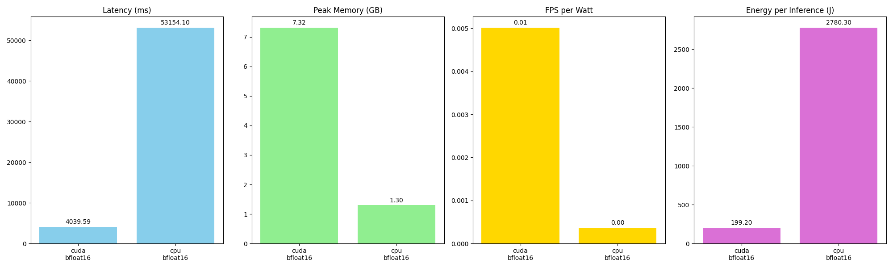

# pytorch

## clone / submodule add vggt

```bash
source venv/bin/activate
git submodule add https://github.com/facebookresearch/vggt.git
uv pip install -e vggt
```

## Test the example

Using the images from `vggt/examples/kitchen/images`, recommends 2 images for speeding and avoiding OOM.

```python
import torch
from vggt.models.vggt import VGGT
from vggt.utils.load_fn import load_and_preprocess_images

device = "cuda" if torch.cuda.is_available() else "cpu"
# bfloat16 is supported on Ampere GPUs (Compute Capability 8.0+) 
dtype = torch.bfloat16 if torch.cuda.get_device_capability()[0] >= 8 else torch.float16

# Initialize the model and load the pretrained weights.
# This will automatically download the model weights the first time it's run, which may take a while.
model = VGGT.from_pretrained("facebook/VGGT-1B").to(device)

# Load and preprocess example images (replace with your own image paths)
image_names = ["vggt/examples/kitchen/images/00.png", "vggt/examples/kitchen/images/01.png"]  
images = load_and_preprocess_images(image_names).to(device)

with torch.no_grad():
    with torch.cuda.amp.autocast(dtype=dtype):
        # Predict attributes including cameras, depth maps, and point maps.
        predictions = model(images)

print(predictions)
```

## Baseline & Benchmark

### pytorch (CPU vs iGPU)

#### Baseline


#### Detailed profiling


#### Trace

- [ ] [WIP] Adding trace now will result in OOM.